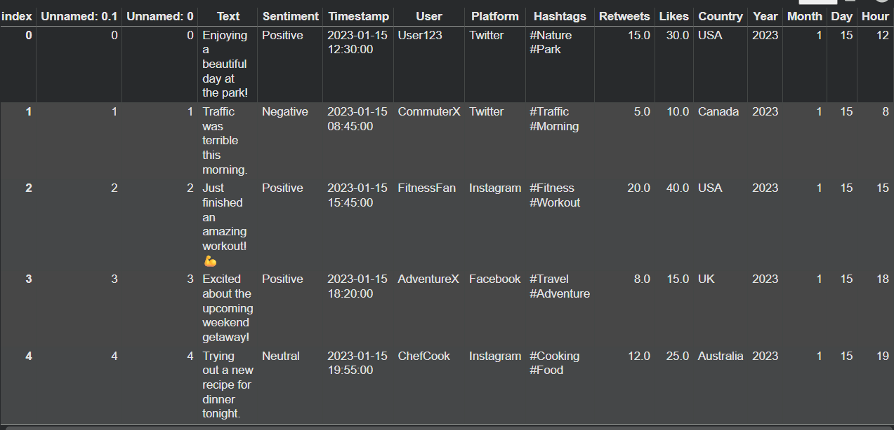
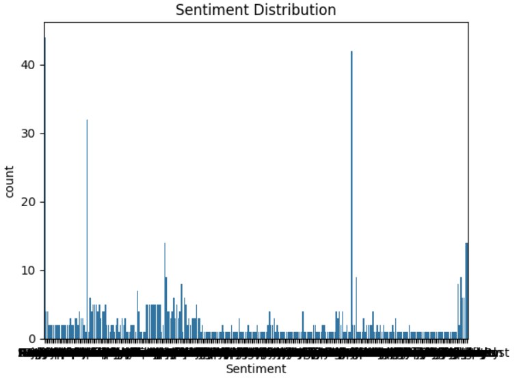

# Sentiment Analysis using Machine Learning

## Project Overview

Sentiment Analysis is a Natural Language Processing (NLP) technique used to determine whether a piece of text expresses a positive or negative sentiment.

In this project, a machine learning model is built to automatically classify text sentiments. This type of analysis is widely used in product reviews, customer feedback analysis, and social media monitoring.

---

## Dataset

The dataset used in this project contains text data along with sentiment labels.

Example columns in the dataset:

* **Text** – The sentence or review
* **Sentiment** – Label indicating whether the sentiment is Positive or Negative

---

## Technologies Used

* Python
* Pandas
* Scikit-learn
* CountVectorizer
* Multinomial Naive Bayes
* Matplotlib
* Seaborn

---

## Project Workflow

The following steps were performed in this project:

1. Load the dataset
2. Perform basic data exploration
3. Convert text data into numerical features using **CountVectorizer**
4. Split the dataset into training and testing sets
5. Train the machine learning model
6. Predict sentiments for the test data
7. Evaluate model performance

---

## Machine Learning Model

The **Multinomial Naive Bayes** classifier was used for sentiment classification because it performs well for text classification problems.

---

## Model Evaluation

The model performance was evaluated using:

* Accuracy Score
* Confusion Matrix

These metrics help measure how accurately the model classifies sentiments.

---

## Visualizations

### Dataset Preview

### Sentiment Distribution

### Model Accuracy

### Confusion Matrix

---

## Results

The machine learning model successfully classifies text sentiment with good accuracy.
The visualizations help understand the dataset distribution and model performance.

---

## Conclusion

This project demonstrates how Natural Language Processing and Machine Learning techniques can be used to automatically analyze text sentiment and extract useful insights from textual data.
