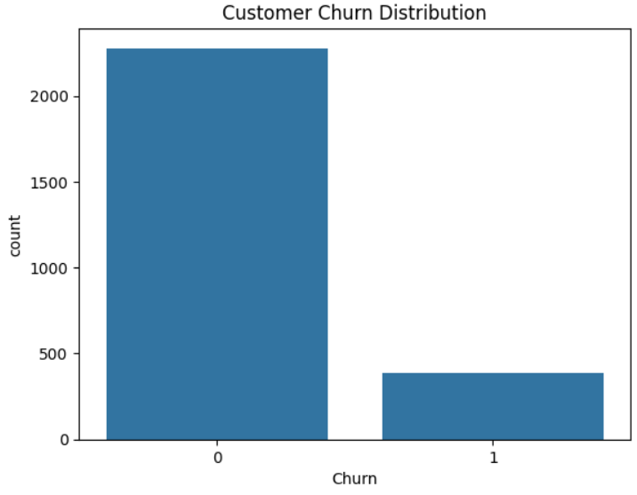
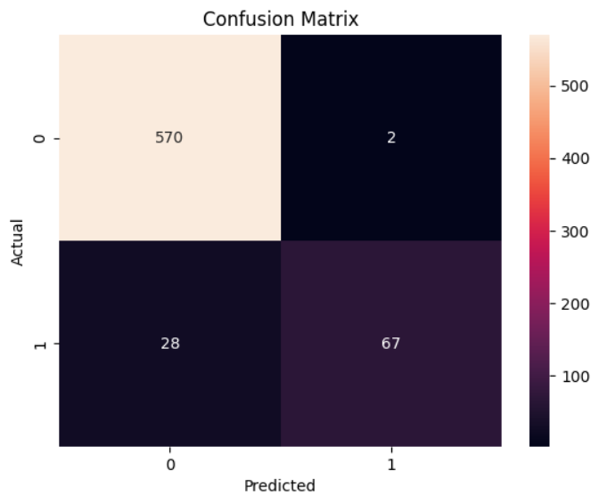
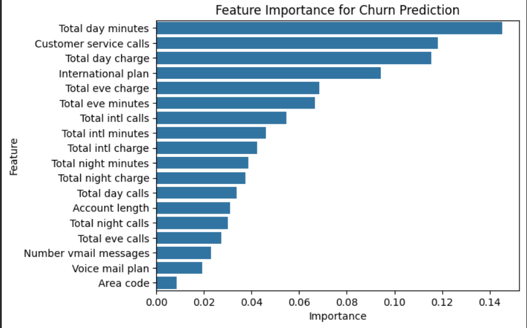

# Customer Churn Prediction using Machine Learning

## Project Overview

Customer churn prediction is an important problem in many industries such as telecommunications, banking, and subscription-based services.
This project aims to predict whether a customer is likely to leave the service using Machine Learning techniques.

By identifying customers who are likely to churn, businesses can take proactive actions to improve customer retention.

---

## Dataset

The dataset used in this project is the **BigML Customer Churn Dataset**.

Files used:

* **churn-bigml-80.csv** – Training dataset
* **churn-bigml-20.csv** – Testing dataset

The dataset contains information about customer behavior such as:

* Call minutes
* Charges
* Subscription plans
* Customer churn status

---

## Technologies Used

* Python
* Pandas
* Scikit-learn
* Seaborn
* Matplotlib

---

## Machine Learning Model

A **Random Forest Classifier** was used to train the churn prediction model.

Steps performed in this project:

1. Data Loading
2. Data Preprocessing
3. Feature Selection
4. Model Training
5. Model Prediction
6. Model Evaluation

---

## Model Evaluation

The performance of the model was evaluated using the following metrics:

* Accuracy Score
* Confusion Matrix
* Feature Importance

These evaluation techniques help understand how well the model predicts customer churn.

---

## Visualizations

### Customer Churn Distribution

### Confusion Matrix

### Feature Importance

---

## Results

The machine learning model successfully predicts customer churn with good accuracy.
The feature importance graph highlights the most influential factors affecting churn.

---

## Conclusion

This project demonstrates how machine learning can be applied to predict customer churn and help businesses make data-driven decisions to improve customer retention.

